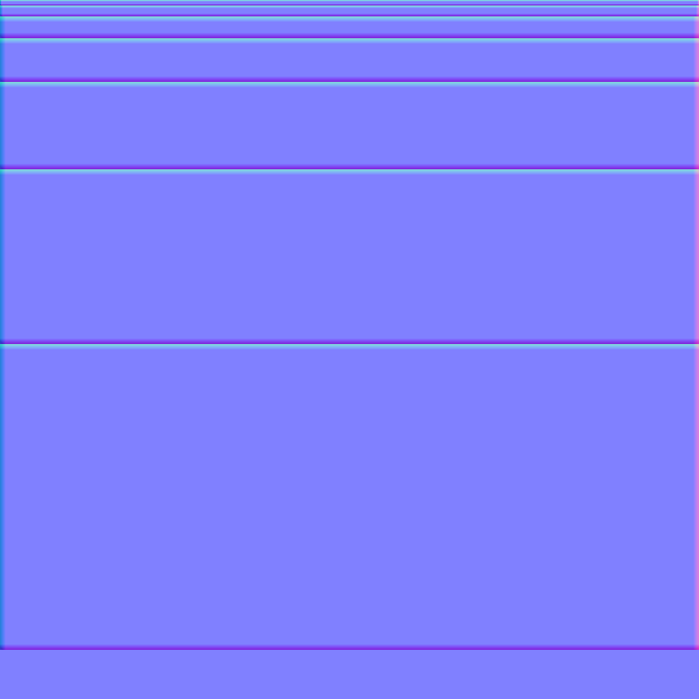

# Modular Assets for Rebel Fork

## Ultimate Trim

The core concept of the content in the repository is described by the "The Ultimate Trim: Texturing Techniques of Sunset Overdrive" talk by Morten Olsen from Insomniac Games:

https://gdcvault.com/play/1022323/The-Ultimate-Trim-Texturing-Techniques

https://gdcvault.com/play/1022324/The-Ultimate-Trim-Texturing-Techniques

The trim sheet shared among assets in the repository:



## Tooling

To install Mesh Topology Toolkit run the following command from repository folder:

```bash
dotnet tool restore
```

If you don't want to map models by hand you can use the following command:

```bash
dotnet trimgen box --trim-height 8 --trim-height 16 --trim-height 32 --trim-height 64 --trim-height 128 --trim-height 256 --trim-height 448 --width 1024 --bevel-width 8 --width-in-units 5 --size-x 0.46 --size-y 0.1  --size-z 0.1 --normal-map -o my-box.glb
```

The trim-height argument defines each trim height in pixels. 
The width argument defines width of the trim texture in pixels.
The bevel-width argument defines max bevel width in pixels.
The width-in-units argument defines how much units in world space the total trim width going to take.

**USE THE SAME --trim-height, --width, --bevel-width AND --width-in-units ARGUMENTS TO GET MATCHING RESULTS!!!**

Size arguments define size of the box you want to generate.

### Key Details of the Method

The "Ultimate Trim" isn't just a texture; it is a workflow and layout standard. It consists of two primary components:

#### The Standardized Trim Layout

Instead of unique textures for every prop, the team used a specific "Trim Sheet" layout. This sheet is divided into horizontal strips (trims) of varying vertical heights.

**Resolution Doubling**: Each subsequent trim strip usually has roughly double the vertical resolution of the one above it.

**Uniformity**: Every material in the game (concrete, metal, plastic, wood) follows this exact same layout. This allows an artist to swap a "Metal" trim material for a "Wood" trim material instantly without needing to redo the UV mapping.

#### 45-Degree Normal Map Bevels

The "Ultimate" part of the name comes from how it handles edges. The normal map for every trim strip includes a 45-degree bevel along the top and bottom edges.

When a modeler aligns the edge of a 3D mesh with these bevels on the trim sheet, the normal map "fakes" a smooth, rounded edge.

This removes the need for high-poly bakes or manually modeling expensive bevels into the geometry.

#### Pros

- Drastically faster than unique baking; assets can be "textured" in minutes by snapping UVs to the grid.
- High texture reuse; dozens of unique-looking buildings can share a single set of trim textures.
- Eliminates "razor-sharp" low-poly edges, giving everything a high-end, polished look.
- Materials can be hotswapped (e.g., turning a clean metal pipe into a rusty one) instantly.

#### Cons

- Requires a rigid setup phase and custom tools (scripts).
- Can lead to "repetitive" looks if not broken up by decals or secondary shaders.
- Locked into the "bevel width" defined by the trim sheet.
- Not ideal for organic shapes or assets requiring unique, complex weathering patterns.

## License

The content of the repository is provided under CC0 license.

https://creativecommons.org/public-domain/cc0/

If you contribute to the repository you do agree that all your work also gets distributed under CC0 license.


